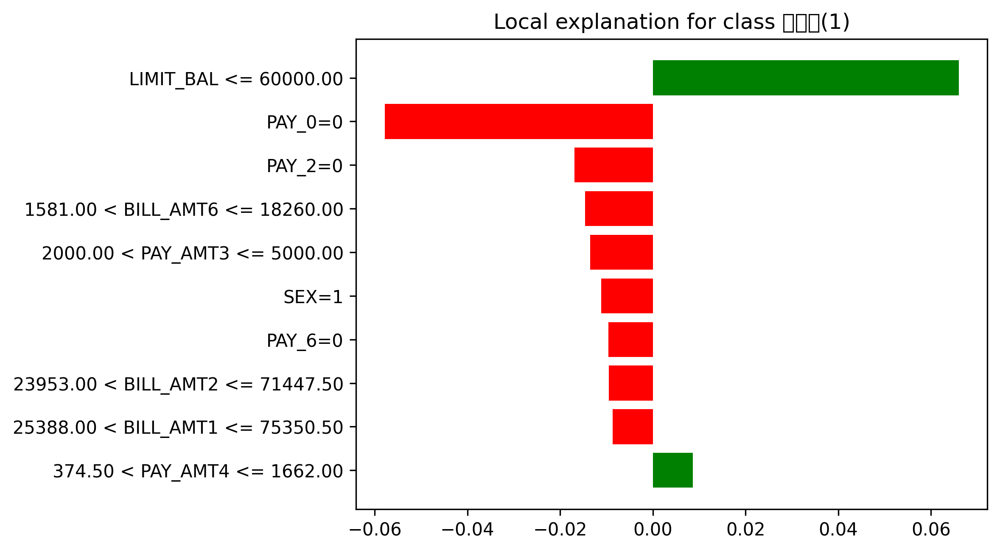

### 🔍 LIME Explanation Result

import matplotlib.pyplot as plt
import matplotlib.font_manager as fm

# 1️⃣ 한글 폰트 설치 (Colab 전용)
!apt-get update -qq
!apt-get install fonts-nanum -qq

# 2️⃣ matplotlib에 적용
font_path = '/usr/share/fonts/truetype/nanum/NanumGothic.ttf'
font_name = fm.FontProperties(fname=font_path).get_name()
plt.rc('font', family=font_name)

print("폰트 적용 완료:", font_name)
fig = exp.as_pyplot_figure()
fig.savefig("lime_result.png", dpi=300, bbox_inches="tight")
plt.close(fig)
